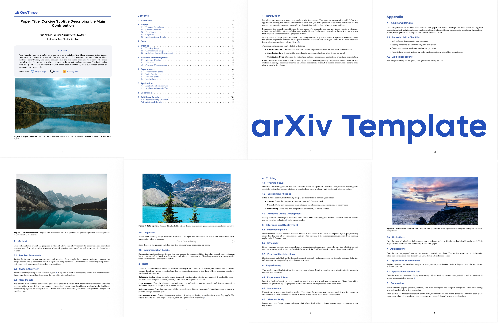

# OneThree arXiv Template



This repository provides a reusable LaTeX template for arXiv-style papers, technical reports, and project manuscripts. It includes a custom title block, author and affiliation formatting, resource links, first-page teaser image, section placeholders, bibliography setup, and appendix support.

## Build

Compile the paper with:

```bash
latexmk -pdf -interaction=nonstopmode -halt-on-error paper.tex
```

The generated PDF is `paper.pdf`.

## File Structure

- `paper.tex`: main entry point. Edit the title, authors, affiliations, abstract, resource links, first-page figure, section order, and bibliography.
- `onethree.cls`: custom document class. It defines page layout, fonts, colors, captions, title block, abstract box, links, header, and appendix style.
- `sections/`: editable paper sections.
- `main.bib`: bibliography entries.
- `assets/`: fonts, resource-link icons, bibliography style, and the default logo.
- `pngs/`: placeholder images used by the template.

## Editing the Paper

Update the main metadata in `paper.tex`:

```tex
\title{Paper Title: Concise Subtitle Describing the Main Contribution}

\author[1]{First Author}
\author[1,2]{Second Author}
\author[2]{Third Author}

\affiliation[1]{Institution One}
\affiliation[2]{Institution Two}
```

Update the abstract in:

```tex
\abstract{
...
}
```

The current resource links are placeholders:

- Project: `https://choucisan.github.io`
- GitHub: `https://github.com/choucisan`
- Hugging Face: `https://huggingface.co/choucsan`

Replace them in the `\checkdata[Resources]` block in `paper.tex`.

## Images

The first-page teaser image is:

```tex
pngs/image.png
```

The section placeholder images are:

```text
pngs/image1.png
pngs/image2.png
pngs/image3.png
pngs/image4.png
```

Replace these files with your own images while keeping the same filenames, or update the corresponding `\includegraphics` paths in `paper.tex` and the files under `sections/`.

By default, images are inserted by width only, such as:

```tex
\includegraphics[width=0.98\linewidth]{pngs/image.png}
```

This preserves the original aspect ratio.

## Logo

The upper-left header logo is:

```text
assets/onethree_logo.jpeg
```

To replace it, put your logo in `assets/` and update the `firststyle` header in `onethree.cls`:

```tex
\includegraphics[width=40mm]{assets/your-logo.pdf}
```

You may adjust the width if your logo has a different aspect ratio.

## Sections

The template includes the following section files:

- `sections/introduction.tex`
- `sections/modeldesign.tex`
- `sections/data.tex`
- `sections/modeltraining.tex`
- `sections/inference.tex`
- `sections/experiments.tex`
- `sections/application.tex`
- `sections/conclusion.tex`
- `sections/appendix.tex`

Edit, rename, remove, or reorder them from `paper.tex` as needed.

## Bibliography

Add references to `main.bib` and cite them with standard BibTeX commands, for example:

```tex
\cite{sample_reference}
```

The template uses:

```tex
\bibliographystyle{plainnat}
\bibliography{main}
```

## Notes

This template intentionally keeps placeholder text and images lightweight. Replace all placeholder content before submission or public release.

LaTeX may emit a `fancyhdr` `headheight` warning because the header keeps the original logo/title-page spacing style. The warning does not prevent PDF generation.

## Acknowledgments

Template reference: ByteDance Seed.

Images from: https://unsplash.com
